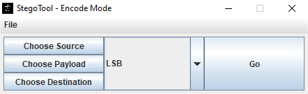

# StegoTool

## What is Steganography?
Steganography is the technique of hiding secret data within an ordinary, non-secret, file or message in order to avoid detection; the secret data is then extracted at its destination. The use of steganography can be combined with encryption as an extra step for hiding or protecting data.

Steganography can be used to conceal almost any type of digital content, including text, image, video or audio content; the data to be hidden can be hidden inside almost any other type of digital content. The content to be concealed through steganography -- called hidden text -- is often encrypted before being incorporated into the innocuous-seeming cover text file or data stream. If not encrypted, the hidden text is commonly processed in some way in order to increase the difficulty of detecting the secret content. 

## What is StegoTool?
StegoTool is a tool that can be used to hide or retrieve a file using the principles of Steganography.

 

# Documentation
Visit our [Documentation Page](https://iamkhattar.github.io/stego-tool/) to view detailed documentation for StegoTool.

# Technology Stack

   

# Contributors

 

# License

[MIT](https://opensource.org/licenses/MIT)
